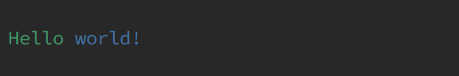
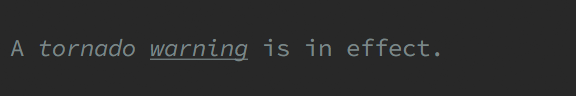
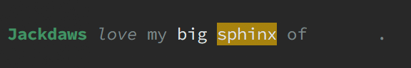
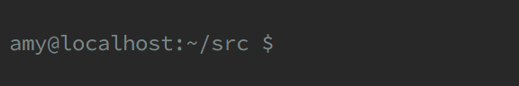
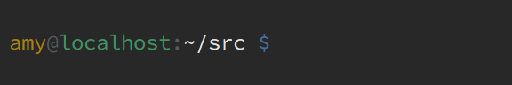

# Colouring and styling terminal text

## SGR syntax

The following control sequence will set the colour and/or style of text in most
modern terminal emulators:

    CSI Pm m

* _`CSI`_ (Control Sequence Introducer) is a control code that tells your emulator to interpret the following bytes as a terminal control sequence. It consists of an escape character followed by an opening bracket, which is sometimes documented as as _`ESC [`_, but you're more likely to have seen it (or used it yourself) in a form like `\e[`, `\E[`, or `\033[`.
* _`Pm`_ is a **m**ultiple **P**arameter consisting of one or more numeric arguments separated by semicolons (`;`).
* The final _`m`_ is literally the lowercase letter _m_, and marks the end of the control sequence.

The components of _`Pm`_ are known as Select Graphic Rendition (SGR) parameters, many of which have been defined in ANSI and ISO standards since the 1970s. Others began as non-standard features of influential terminals like the DEC VT series, but are now widely supported by emulators seeking maximum fidelity to the classics.

### Example

You can find more codes in the tables below, but for now we'll stick with a simple underline (SGR code `4`) and the colour blue (`34`). This is how you would output blue, underlined text to a terminal:

```
\e[4;34mI am blue (and underlined)\e[0m
```

* `\e` represents the `ESC` character, which we obviously can't type by pressing the _Esc_ key on our keyboard, and `[` completes the `CSI` code.
    * Most applications will also recognize a capital `\E` or numerical `\033` as `ESC`. And if you _could_ type with your keyboard's _Esc_ key, the character it produces would work too.
* Because we're setting two attributes at once, the `4` and `34` are separated with a semicolon.
* The lowercase `m` completes the control sequence.

The terminal will now print all text in underlined blue until we tell it to stop, so we do—our trailing control sequence's only parameter, `0`, resets _all_ SGR attributes, both colour and style.

Setting the attributes with separate control sequences works too (because `\e[0m` resets everything, we only need it once):

```
\e[4m\e[34mI am blue (and underlined) too\e[0m
```

### SGR attribute codes: Style

| attribute     | on    | off   | support   |
| ------------- | :---: | :---: | :-------- |
| reset all     | 0     | N/A   | common    |
| bold          | 1     | 22    | common    |
| dim           | 2     | 22    | uncommon  |
| italic        | 3     | 23    | rare      |
| underline     | 4     | 24    | common    |
| blink         | 5     | 25    | common    |
| rapid blink   | 6     | 25    | very rare |
| reverse       | 7     | 27    | common    |
| invisible     | 8     | 28    | uncommon  |
| strikethrough | 9     | 29    | rare      |

Notes:

* `21` is _not_ "not bold"—this rarely-supported code turns on double underlining (which can be turned off with `24`). Use `22` to deactivate both bold (`1`) and dim (`2`) settings.
* Some terminals may support the sequence for turning on an attribute without supporting the corresponding sequence to turn it off. :/

### SGR attribute codes: Colour

| colour  | normal FG | bright FG | normal BG | bright BG |
| ------- | :-------: | :-------: | :-------: | :-------: |
| black   |        30 |        90 |        40 |       100 |
| red     |        31 |        91 |        41 |       101 |
| green   |        32 |        92 |        42 |       102 |
| yellow  |        33 |        93 |        43 |       103 |
| blue    |        34 |        94 |        44 |       104 |
| magenta |        35 |        95 |        45 |       105 |
| cyan    |        36 |        96 |        46 |       106 |
| white   |        37 |        97 |        47 |       107 |
| default |        39 |       N/A |        49 |       N/A |

Notes:

* Because many emulators (either by default or as a configuration setting) conflate "bright" colours with "bold," sequences like `\e[1;31m` (bold + normal red) are overwhelmingly more common than sequences like `\e[91m` (bright red). Because this can produce unexpected results in different, or differently-configured, emulators, I recommend using `1` only for **actual bold text**, and `90–97` when you just want a brighter colour.

### A few more examples

Subsequent colour-setting sequences will override previous colours...

    \e[32mHello \e[34mworld!\e[0m



...but subsequent attribute settings may not...

    A \e[3tornado \e[4mwarning\e[0m is in effect.



...unless turned off explicitly:

    \e[1;32mJackdaws\e[0m \e[3mlove\e[23m my \e[97mbig \e[43msphinx\e[0m of \e[5;35mquartz\e[0m.



If you don't want to use `0` to reset _everything_, many terminals support `39`
and `49` to restore the default foreground and background colours, respectively:

    \e[4;41;93mALPHA\e[49m BETA\e[39m GAMMA\e[24m DELTA


## Configuration

### bash

You can use escape sequences to add some colour to your bash prompt, but there's a catch: the underlying display mechanism needs to know how long the prompt is so that it can draw and re-draw the screen properly, but adding colour codes makes your prompt "longer" without actually changing its size when displayed.

Fortunately, bash provides a way to mark non-printing sequences in your prompt strings: anything wrapped in backslashes and brackets `\[like this\]` will appear in your prompt without counting towards its "length" for display purposes.

So you can turn this...

    \u@\h:\w \$ 



...into this:

    \[\e[33m\]\u\[\e[39;2m\]@\[\e[22;32m\]\h\[\e[39;2m\]:\[\e[22;97m\]\w\[\e[0m\] \[\e[34m\]\$ \[\e[0m\]



### grep

grep's optional coloured output handles the control sequences for you, and can be configured by adding SGR codes to the `GREP_COLORS` environment variable:

    sl=39:cx=90:mt=31:ms=43;97:mc=43;30:fn=32:ln=34:bn=36:se=0

For a permanent and slightly more readable solution, modify the following code as you like and place it into your shell startup file (e.g. `~/.bashrc`):

```bash
export GREP_COLORS=""

# Whole selected (matching) lines; or non-matching lines if -v is specified
GREP_COLORS+="sl=39:"

# Whole context (non-matching) lines; or matching lines if -v is specified
GREP_COLORS+="cx=90:"

# Matching text in any matching line, regardless of -v
GREP_COLORS+="mt=31:"

# Matching text in a selected line (if -v is omitted)
GREP_COLORS+="ms=43;97:"

# Matching text in a context line (if -v is specified)
GREP_COLORS+="mc=43;30:"

# Filename in line prefix
GREP_COLORS+="fn=32:"

# Line number in line prefix
GREP_COLORS+="ln=34:"

# Byte offset in line prefix
GREP_COLORS+="bn=36:"

# Separators between fields
GREP_COLORS+="se=0"
```

### gcc

GCC offers a similar environment variable, `GCC_COLORS`, to configure its colourized diagnostic output; fortunately, the syntax is slightly less opaque than grep's.

```bash
export GCC_COLORS=""

GCC_COLORS+="error=91:"
GCC_COLORS+="warning=33:"
GCC_COLORS+="note=34:"
GCC_COLORS+="caret=95:"
GCC_COLORS+="locus=90:"
GCC_COLORS+="quote=32"
```

### less

You can also use environment variables to configure the colours that less uses to output `man` pages. There are examples all over the internet showing a long list of potential options, but only two are used in 99% of cases:

```bash
# Reset everything
export LESS_TERMEND=$'\e[0m'

# Begin/end "bold" mode -- used for headings
export LESS_TERMCAP_md=$'\e[32m'
export LESS_TERMCAP_me=$LESS_TERMEND

# Begin/end "underline" mode -- used to highlight variables
export LESS_TERMCAP_us=$'\e[33m'         
export LESS_TERMCAP_ue=$LESS_TERMEND    
```

Note the `$'...'` syntax containing the escape sequences. This turns the `\e` from a backslash + lowercase letter into an actual `ESC` character.
